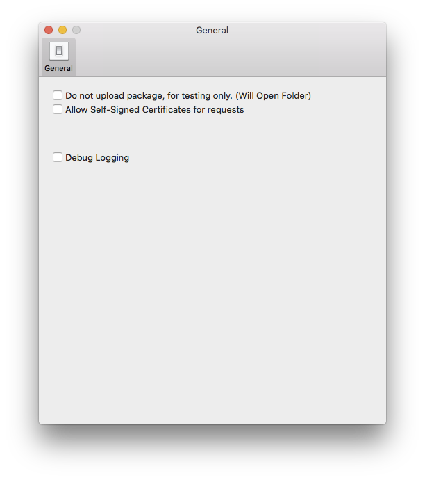
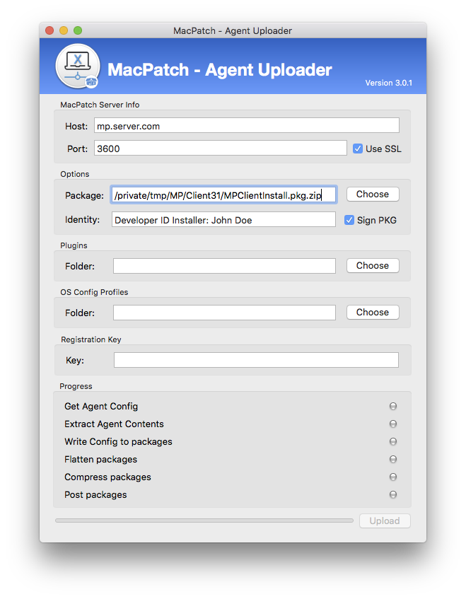

# MacPatch 3.1.0 - Client Build and Upload

### Description
This document will walk you through the build and upload of the MacPatch 3.1.x client agent.

When cloning the MacPatch software from GitHub includes the latest version of the client agent software. All of the bnaries are signed as part of this process. This compiled agent can be uploaded to the MacPatch server as is. If you wish to build and compile your own client agent, this is fully supported as well.

### Table of Contents
* [Requirements](#a1)
* [Build Client](#a2)
* [Upload Client](#a3)

--

### Requirements 
- Operating System:
	- macOS
		- Mac OS X 10.10 or higher
- Xcode.app and command line developer tools
	- the license agreement needs to have been accepted.

--

### Build and Compile Client Software 
Compiling the MacPatch client software is a pretty simple process. Inside the cloned MacPatch repository contains the `MPBuildClient.sh` script. This script will need to be run using sudo. 

The script will ask a few questions in regards to building the client installer package. First you will be asked for the client version. Please enter a client version. Since your compiling your own you can use what ever versioning you wish. Next a build number is required and a miniumum macOS version. With those settings entered, you only have 2 more. Next you'll be asked for agent build state, by default it's set to release. If your going to tweek the agent I recommend using the Alpha and Beta stages. The last question is if you want to code sign the MacPatch client binaries.

**Note:** Please use the Mac Developer certificate to sign your binaries.

Once completed the script will open the directory containing the zipped PKG installer of the MacPatch client. The directory is `/private/tmp/MP/Client31`. 

### Upload Client Software 

Uploading the client agent is a fairly simple process. Either you will upload the `MPClientInstall.pkg.zip` from `/opt/MacPatch/Source/Agent` or from `/private/tmp/MP/Client31`, if you have compiled the agent your self.

To get the agent uploader application you can login to the agent console and download it from `Admin-> Client Agents -> Deploy` or `/opt/MacPatch/Server/conf/Content/Web/tools/MPAgentUploader.zip`.

Before uploading your agent it is recommended that you verify your MacPatch server settings in the MacPatch admin console. Make sure it's enabled and that the host name and settings are correct. This can be verified at `Admin-> MacPatch Servers`

##### Uploading 

When uploading a new agent it's recommended that you QA the agent first by compiling and siging the agent installer localy and test it out before uploading the agent to the server.

To build it locally with the server settings go to Preferences and select "Do not upload package".

 

The agent uploader only has a few options. Here is a list and their definitions

| Attribute | Description | Optional |
|---|---|---|
|Host| Host name of the MacPatch master server| Required |
|Port| Port of the MacPatch master server api. 3600 is the default.| Required |
|Package| Please use the choose button to propogate the agent path. Also please use the pkg.zip| Required |
|Identity| The apple installer certificate identity e.g(Developer ID Installer: ...)| Optional |
|Sign PKG| Enable package signing, this is highly recommended. | Optional |
|Plugins| MacPatch supports custom inventory plugins, this is a directory containing your custom plugins.| Optional |
|OS Config Profiles| Directory containing macOS config profiles to get installed with the agent. I use this for intermediate certificates.| Optional |
|Registration key| Registration key to register the client with the MacPatch server. This feature is optional if using Auto registration.| Optional |

 

