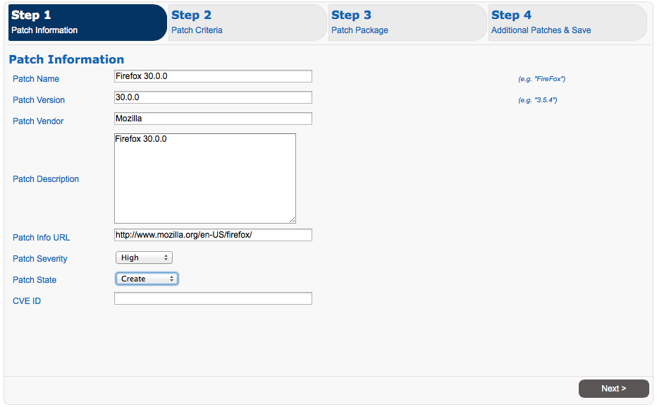
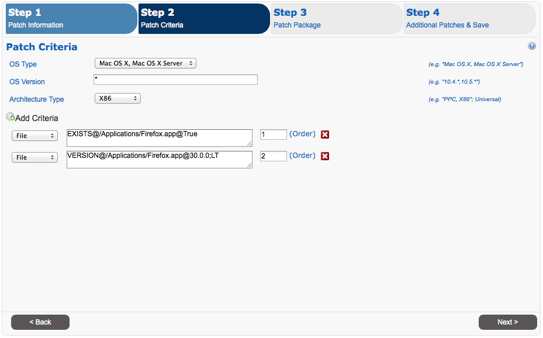
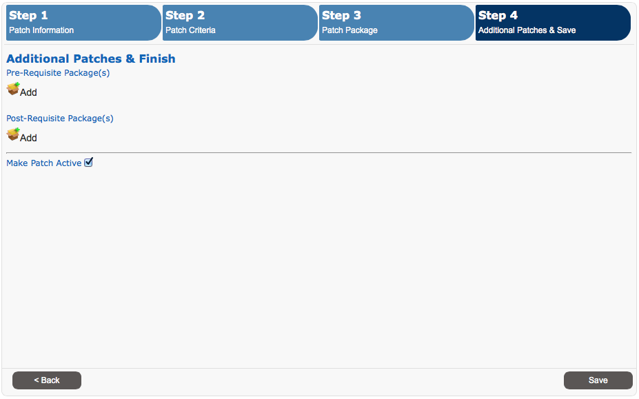

#MacPatch - Custom Patch Content
**Version 1.0 for MacPatch v2.5.x**

MacPatch custom patch content is pretty simple to create. All content is created via the new content wizard. Keep in mind that there are only 4 required attributes which are required to create a patch. The 4 attributes are **Patch Name, Patch Version, Patch Group ID, Patch Package**. 

### Create New Patch

Creating a new patch is broken down in to 4 steps. In this example we will be creating a patch for Firefox.

##### Step 1

**Patch Name, and Patch Version **are required fields. By default a new patch has it's patch state set to "Create". A patch will not show as needed to a client until it's state is at least set to "QA".

##### Step 2

While none of the fields are required, adding patch detection criteria is highly recommended. In this example we have added two detection queries. The first one looks to see if the **/Applications/Firefox.app** exists. The second query looks to see if Firefox version is less than 30.0.0. 

For a patch to become required all patch detection criteria queries need to return *True*. If any return false a patch is not needed.

[Query Language Cheat Sheet](#cheatSheet)

##### Step 3

**Patch Group ID, and Patch Package **are required fields. 

In this example it's important to note that the "Patch Group ID" is in the form Reverse URL and similar to Bundle ID. While anything can be used as a "Patch Group ID", bundle id's are suggested.

When uploading a patch a *.pkg.zip file is required at this time. 

##### Step 4

Here you can add pre & post requisite packages. Also, once the patch is created you will need to make it active. This can only be done once the initial patch has been created.

### Patch Criteria Language - Cheat Sheet 
<table>
<tr>
<th>Base Criteria</th>
<th>Description</th>
</tr>
<tr>
<td>BundleID</td>
<td>
<table id="sampleInner">
<tr>
<th>Query</th>
<th>Value</th>
<th>Query Result</th>
<th>Example Syntax</th>
</tr>
<tr>
<td>Exists</td>
<td>BundleID Value</td>
<td>True/False</td>
<td>Exists@com.adobe.Reader@True</td>
</tr>
<tr>
<td>Version</td>
<td>BundleID Value</td>
<td>Version;(EQ,LT,LTE,GT,GTE,NEQ)</td>
<td>Version@com.adobe.Reader@9.3.0;LT</td>
</tr>
</table>
</td>
</tr>
<tr>
<td>File</td>
<td>
<table id="sampleInner">
<tr>
<th>Query</th>
<th>Value</th>
<th>Query Result</th>
<th>Example Syntax</th>
</tr>
<tr>
<td>Exists</td>
<td>File Path</td>
<td>True/False</td>
<td>Exists@/Applications/Firefox.app@True</td>
</tr>
<tr>
<td>Date</td>
<td>File Path</td>
<td>True/False</td>
<td>Date@/Applications/Firefox.app@2010-03-22 12:00:00;LT</td>
</tr>
<tr>
<td>Hash</td>
<td>File Path</td>
<td>MD5 Hash;True/False</td>
<td>Hash@/Applications/Firefox.app@123432dsh2362h3h;TRUE</td>
</tr>
<tr>
<td>Version</td>
<td>File Path</td>
<td>Version;(EQ,LT,LTE,GT,GTE,NEQ)</td>
<td>Version@/Applications/Firefox.app@3.5.7;LT</td>
</tr>
</table>
</td>
<tr>
<td>Script</td>
<td>
<table id="sampleInner">
<tr>
<th>Query</th>
<th>Value</th>
<th>Query Result</th>
<th>Example Syntax</th>
<th>Notes</th>
</tr>
<tr>
<td>Script</td>
<td>Script Text</td>
<td>True</td>
<td>#!/bin/sh ...</td>
<td>If a @ is used it must be escaped with @</td>
</tr>
</table>
</td>
</tr>
</tr>
</table>

#### Testing Patch Content 

To test patch content you will need to edit the client settings those clients deemed as QA clients. This is done by creating a new patch group with the "QA" type and editing the clients config plist. 

Change PatchGroup 
	
	defaults write /Library/Preferences/gov.llnl.mpagent.plist PatchGroup RecommendedPatchesQA
	
Allow QA Patches to be installed

	defaults write /Library/Preferences/gov.llnl.mpagent.plist PatchState All